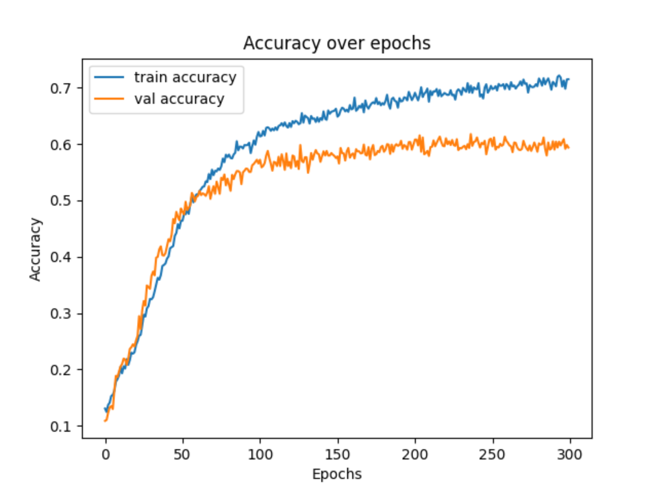
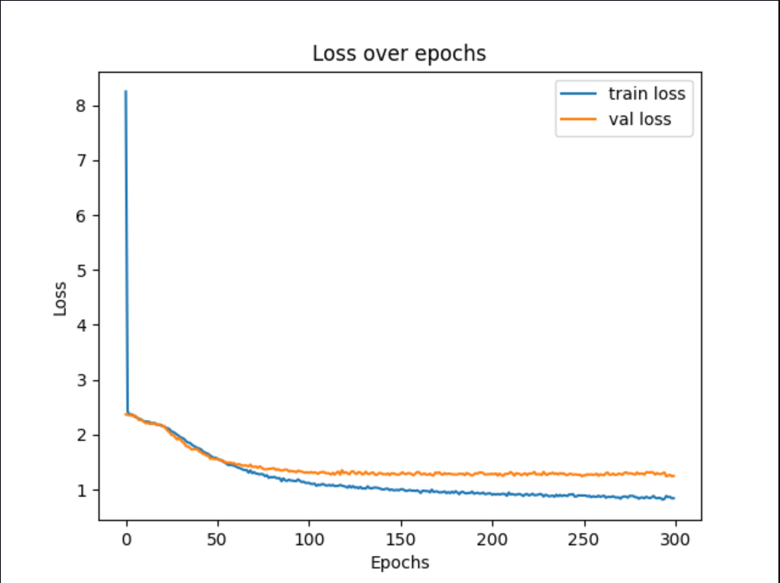
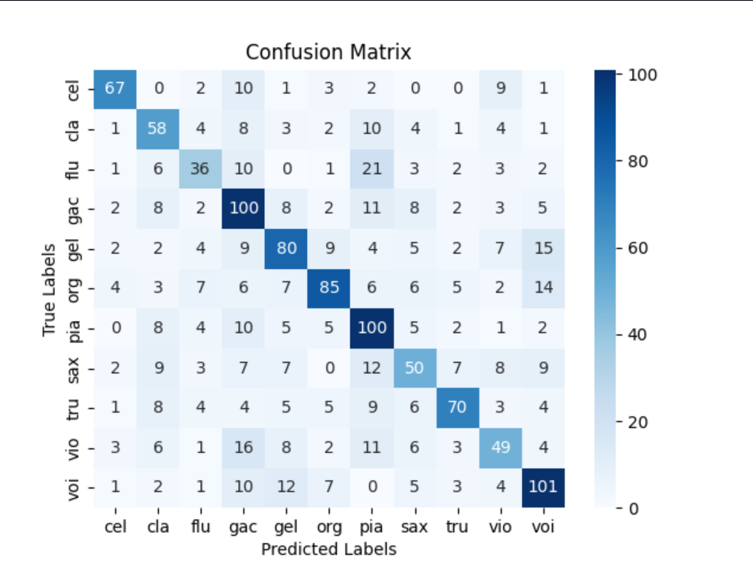

# Instrument Classifier Project

This project is designed to classify musical instruments based on audio files using machine learning. It uses a pre-trained neural network to predict the type of instrument being played in a given audio file.

The key features of the project include:
- **Data Preprocessing**: Extracting features from audio files (MFCCs) and trimming silence.
- **Model Training**: Training a neural network using the extracted features and the labels associated with each instrument.
- **Model Prediction**: Predicting the instrument of an audio file using a trained model.
- **Visualization**: Displaying a confusion matrix and training history for model performance evaluation.


## Prerequisites

Make sure you have the following installed:
- Python 3.7+
- TensorFlow/Keras
- Librosa
- NumPy
- scikit-learn
- Matplotlib
- Seaborn
- tqdm
- joblib

You can install the necessary Python libraries using:

```bash
pip install tensorflow librosa numpy scikit-learn matplotlib seaborn tqdm joblib
```


### Inspiration

For inspiration I used the following repository https://github.com/IvyZX/music-instrument-classifier, and I improved overall the accuracy of the model
and used a much larger dataset, the one that I found here : https://www.upf.edu/web/mtg/irmas. The code was quite old too, and written in a different 
version of python so I had to update it to the latest version of python and tensorflow.


## Usage

### Dataset
Before running the scripts, make sure to have a dataset of audio files organized in folders by instrument.
The dataset should be placed inside the IRMAS-TrainingData directory, or wherever you choose to, with each folder corresponding to an instrument.
To start training the model from scratch, ensure the dataset is available in the IRMAS-TrainingData folder and run the classify.py file.

### Prediction

Once the model is trained, you can predict the instrument from any audio file by running the test.py file which will prompt you to enter the path 
to the instrument you want to test.

To predict the instrument for a given audio file:
1. Ensure the trained model and label map are available (instrument_model.h5 and label_map.pkl).
2. Run the test.py script and provide the path to the audio file when prompted.

### What the script does

The classify.py script handles model training. It will:

- Check if the model already exists. If the model is present, training is skipped.
- Extract MFCC features from audio files.
- Train a neural network with two dense layers and dropout for regularization.
- Save the trained model and label map for future use.
- Plot accuracy and loss curves to monitor training.
- Display a confusion matrix for the test set to visualize classification performance.

## Feature extraction

Feature extraction is performed by the preprocessing.py script. This script:

- Loads audio files using librosa.
- Removes leading and trailing silence from the audio.
- Extracts MFCC features for each audio sample.
- Saves the extracted features and labels for training the neural network.
- Instruments are selected based on their presence in the IRMAS-TrainingData directory.

## Functions Overview

### `train_and_save_model(data, labels, label_map)`
- **Description**: Trains and saves the model based on the input data and labels. Also plots the accuracy, loss, and generates a confusion matrix.
- **Parameters**:
  - `data`: Numpy array of feature data used for training.
  - `labels`: Numpy array of corresponding labels for each data point.
  - `label_map`: A dictionary mapping instrument labels to integer values.
- **Output**: Saves the trained model (`instrument_model.h5`) and label map (`label_map.pkl`), and returns the trained model.

### `plot_accuracy_and_loss(history)`
- **Description**: Plots the accuracy and loss over epochs to visualize the model's training performance.
- **Parameters**:
  - `history`: The training history object returned by the model's `fit` method, containing training and validation accuracy/loss.
- **Output**: Displays accuracy and loss graphs for training and validation over epochs.

### `generate_confusion_matrix(model, X_test, y_test, label_map)`
- **Description**: Generates and visualizes a confusion matrix for the test set predictions.
- **Parameters**:
  - `model`: The trained model used for prediction.
  - `X_test`: Test dataset features.
  - `y_test`: True labels for the test dataset.
  - `label_map`: A dictionary mapping instrument labels to integer values.
- **Output**: Displays a confusion matrix showing the comparison between predicted and true labels.

### `load_model_and_label_map()`
- **Description**: Loads the saved model (`instrument_model.h5`) and the label map (`label_map.pkl`).
- **Output**: Returns the loaded model and label map.

### `predict(audio_filename, model, label_map)`
- **Description**: Predicts the instrument from an audio file by extracting MFCC features and using the trained model to make predictions.
- **Parameters**:
  - `audio_filename`: Path to the audio file for prediction.
  - `model`: The trained model used for prediction.
  - `label_map`: A dictionary mapping instrument labels to integer values.
- **Output**: Prints the predicted instrument based on the audio input.

## Visualization

The following plots were generated during model training and evaluation:

### 1. Accuracy over Epochs

This plot shows the training and validation accuracy over 300 epochs. It indicates how well the model is performing over time, with the training accuracy improving steadily and the validation accuracy stabilizing after a certain number of epochs.



### 2. Loss over Epochs

This plot shows the training and validation loss over 300 epochs. The loss measures how well the model is learning, and a lower loss value indicates better performance. The training loss decreases consistently, while the validation loss stabilizes after some time.



### 3. Confusion Matrix

The confusion matrix shows the model's performance on the test dataset. It gives a detailed breakdown of correct and incorrect predictions for each instrument class. Each row represents the true label, while each column represents the predicted label. The diagonal elements show correct predictions.




[README.md](README.md)